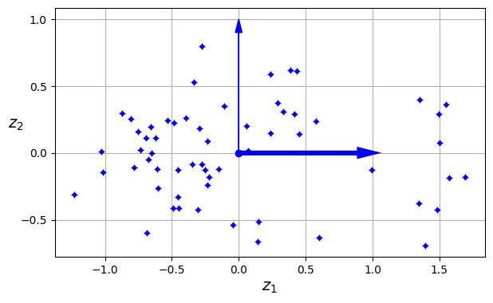
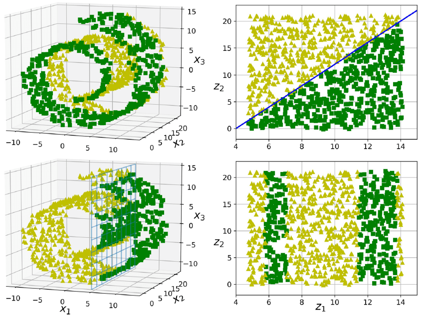

# **Feature Engineering**

## Dimensionality Reduction

---

## The Curse of Dimensionality
A large number of features is not always useful. Not only does this make training extremely slow, it can also make it much harder to find a good solution. This problem is often referred to as the *curse of dimensionality*.

We discussed filtering and feature scaling as ways of pruning away uninformative features. Now we will take a close look at feature dimensionality reduction using **principal component analysis** (PCA).

---

## Main Approaches for Dimensionality Reduction

Before we dive into specific dimensionality reduction algorithms, let’s take a look at the two main approaches to reducing dimensionality:

- Projection
- Manifold Learning

---

### Projection

In most real-world problems, training instances are not spread out uniformly across all dimensions.

As a result, all training instances actually lie within (or close to) a much lower-dimensional subspace of the high-dimensional space.

---

### Projection

In most real-world problems, training instances are not spread out uniformly across all dimensions.

As a result, all training instances actually lie within (or close to) a much lower-dimensional subspace of the high-dimensional space.

---
### Projection

However, projection is not always the best approach to dimensionality reduction. 
In many cases the subspace may twist and turn, such as in the famous *Swiss roll* toy dataset.

---
### Manifold Learning

A 2D manifold is a 2D shape that can be bent and twisted in a higher-dimensional space. More generally, a $d$-dimensional manifold is a part of an $n$-dimensional space (where $d < n$) that locally resembles a $d$-dimensional hyperplane. 

In the case of the Swiss roll, $d = 2$ and $n = 3$: **it locally resembles a 2D plane**, but it is rolled in the third dimension.

---
### Manifold Learning

Many dimensionality reduction algorithms work by modeling the manifold on which the training instances lie; this is called **Manifold Learning**. 

This relies on the *manifold assumption*, which holds that most real-world high-dimensional datasets lie close to a much lower-dimensional manifold. 

This assumption is very often empirically observed.

---
### Manifold Learning

The manifold assumption is often accompanied by the implicit assumption that
the task at hand will be simpler if expressed in the lower-dimensional space of the manifold.

However, this assumption does not always hold.

---
### Manifold Learning

In short, if you reduce the dimensionality of your training set before training a model, it will usually speed up training, but it may not always lead to a better or simpler solution; it all depends on the dataset.

